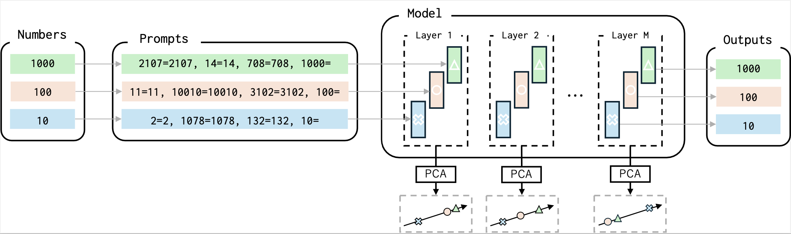
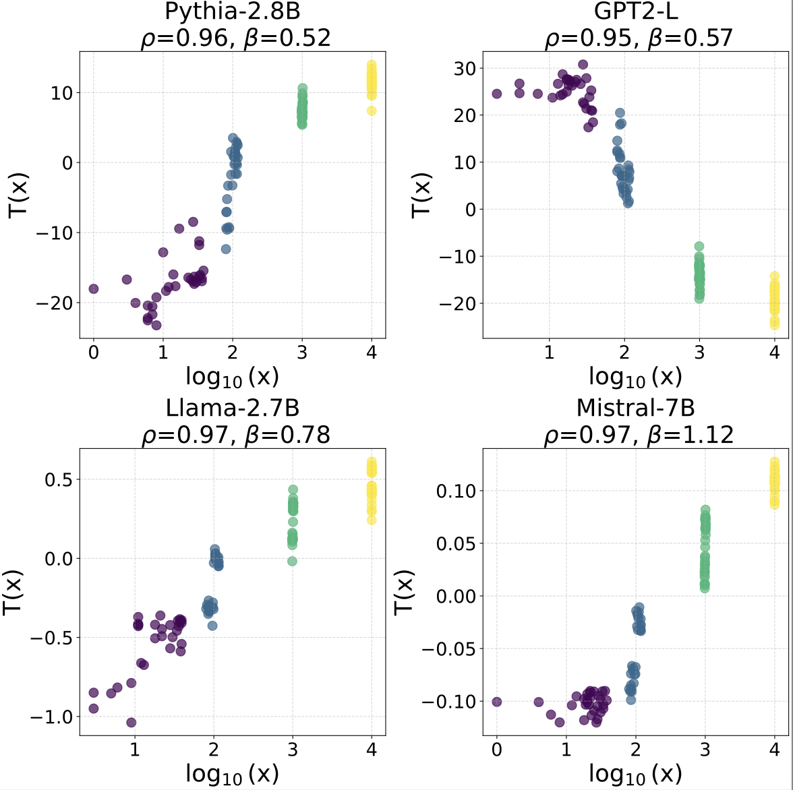
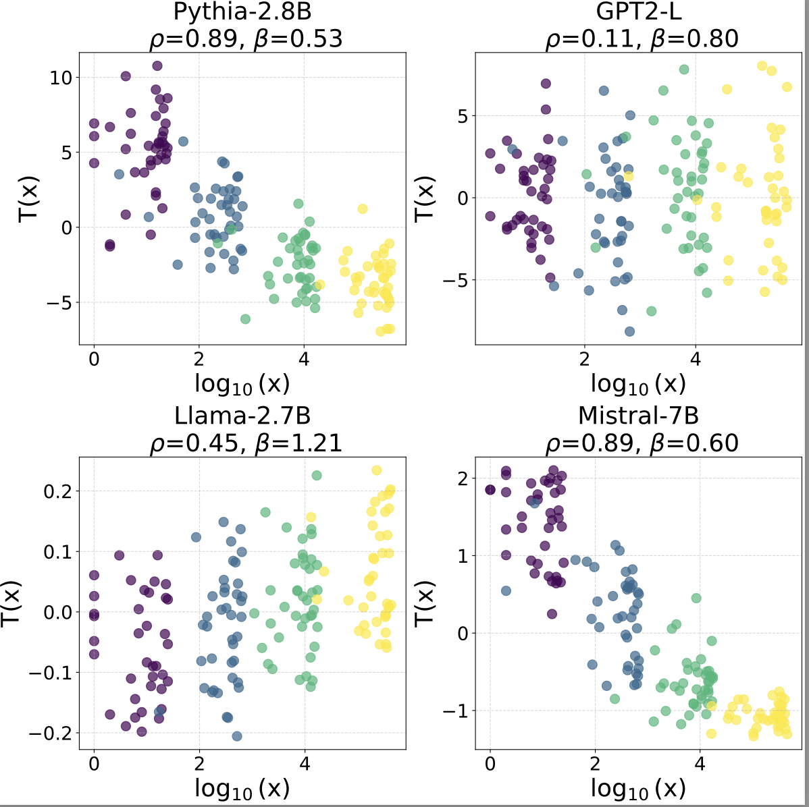

# Number Representations in LLMs: A Computational Parallel to Human Perception


## Table of Contents
- [Motivation](#motivation)
- [Results](#results)
- [Figures](#figures)
- [Citations](#citations)
- [How to Run the Code](#how-to-run-the-code)
- [Contributors](#contributors)
- [License](#license)

## Motivation
Humans are believed to perceive numbers on a logarithmic mental number line, where smaller values are represented with greater resolution than larger ones. Inspired by this hypothesis, we investigate whether large language models (LLMs) exhibit a similar logarithmic-like structure in their internal numerical representations. By analyzing how numerical values are encoded across different layers of LLMs, we apply dimensionality reduction techniques such as PCA and PLS followed by geometric regression to uncover latent structures in the learned embeddings. Our findings reveal that the model’s numerical representations exhibit sublinear spacing, with distances between values aligning with a logarithmic scale. This suggests that LLMs, much like humans, may encode numbers in a compressed, non-uniform manner.

## Results

Below are some visualizations of our results:


*Caption: Comparison of several models on Numbers and Letters groups, evaluated using three metrics: $\rho$, $\beta$, and $R^2$. Results are reported for the layer with the highest $R^2$. Standard deviations are included.*


*Caption: Projections of letters representations (y-axis) against their log-scaled magnitudes (x-axis) assigned proportional to their length, for the layer with the highest explained variance in four models. Sublinearity and monotonicity ($\rho$) are indicated above each subfigure, demonstrating consistent sublinear trends and strong monotonic relationships across models.*


## Citations

If you find our work useful, please cite our paper:

```bibtex
@article{alquboj2025number,
  title={Number Representations in LLMs: A Computational Parallel to Human Perception},
  author={AlquBoj, HV and AlQuabeh, Hilal and Bojkovic, Velibor and Hiraoka, Tatsuya and El-Shangiti, Ahmed Oumar and Nwadike, Munachiso and Inui, Kentaro},
  journal={arXiv preprint arXiv:2502.16147},
  year={2025}
}

```
## How to Run the Code
```markdown

To reproduce our results, follow these steps:

1. Clone the repository:

   git clone the repo
   cd repo_name

2. Add the login token in main.py.

3. Find the metrics by running run.sh (after updating the models and setting in the .sh file)
   
   ./run.sh
